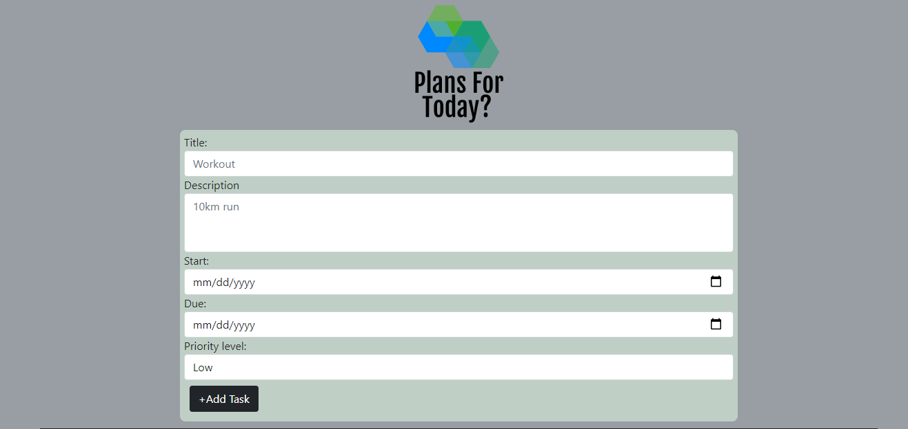

# TypescriptToDo
A To-do App created using HTML, CSS and Typescript.

## Live Demo
[Live Demo Link](https://natashac18.github.io/TypescriptToDo/)

## Screenshot

## Built With

- Html
- CSS
- Typescript

## Tested With

Live Server

## Getting Started

To get a local copy up and running follow these simple steps.
### Prerequisites
- A Code Editor of your choice

### To clone the repo to your local repository:
`https://github.com/natashac18/TypescriptToDo.git`

`cd TypescriptToDo.git`

Open index.html in your preferred browser

## Author

:bust_in_silhouette: **Natasha Chitongo** 

GitHub: [@natashac18](https://github.com/natashac18)

## Show your support! 

If you like this project, please give it a :star: !
